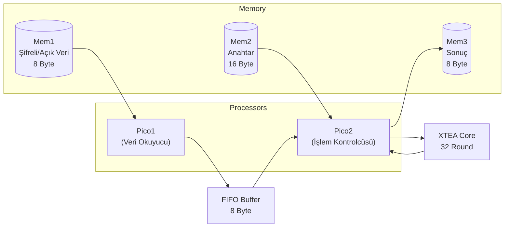
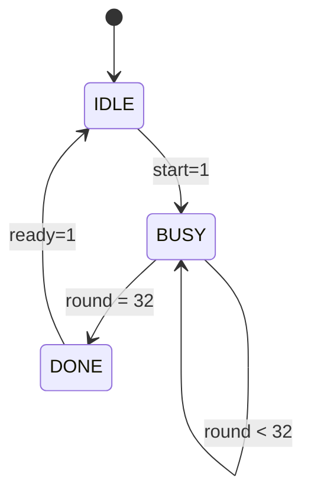

# Dual PicoBlaze XTEA Şifreleme/Şifre Çözme Sistemi

## 🎯 Projenin Amacı
Bu proje, iki adet **PicoBlaze (KCPSM6)** soft işlemci kullanarak **XTEA (eXtended Tiny Encryption Algorithm)** şifreleme/şifre çözme işlemi gerçekleştiren bir gömülü sistem tasarımıdır.

---

## 📐 Sistem Mimarisi



---

## 📁 Dosya Yapısı ve Görevleri

| Dosya | Tür | Görevi |
|-------|-----|--------|
| [top.v](file:///c:/Users/PC/Downloads/gömülü_final_proje/top.v) | Verilog | Ana modül - tüm bileşenleri bağlar |
| [kcpsm6.vhd](file:///c:/Users/PC/Downloads/gömülü_final_proje/kcpsm6.vhd) | VHDL | PicoBlaze 6 işlemci çekirdeği |
| [pico1_rom.vhd](file:///c:/Users/PC/Downloads/gömülü_final_proje/pico1_rom.vhd) | VHDL | Pico1'in program belleği |
| [pico2_rom.vhd](file:///c:/Users/PC/Downloads/gömülü_final_proje/pico2_rom.vhd) | VHDL | Pico2'nin program belleği |
| [pico1_code.psm](file:///c:/Users/PC/Downloads/gömülü_final_proje/pico1_code.psm) | Assembly | Pico1 assembly kaynak kodu |
| [pico2_code.psm](file:///c:/Users/PC/Downloads/gömülü_final_proje/pico2_code.psm) | Assembly | Pico2 assembly kaynak kodu |
| [xtea_core.v](file:///c:/Users/PC/Downloads/gömülü_final_proje/xtea_core.v) | Verilog | XTEA şifreleme/çözme donanımı |
| [fifo_buffer.v](file:///c:/Users/PC/Downloads/gömülü_final_proje/fifo_buffer.v) | Verilog | İşlemciler arası veri tamponu |
| [single_port_ram.v](file:///c:/Users/PC/Downloads/gömülü_final_proje/single_port_ram.v) | Verilog | Bellek modülü (Mem1, Mem2, Mem3) |
| [tb_top.v](file:///c:/Users/PC/Downloads/gömülü_final_proje/tb_top.v) | Verilog | Simülasyon testbench'i |

---

## 🔄 Adım Adım Çalışma Prensibi

### Adım 1: Sistem Başlatma
Sistem reset sonrası her iki PicoBlaze işlemci de ROM'larındaki programı çalıştırmaya başlar.

### Adım 2: Pico1 - Veri Okuma ve FIFO'ya Yazma

```
┌─────────────────────────────────────────────────────────┐
│  PICO1 GÖREVI                                           │
├─────────────────────────────────────────────────────────┤
│  1. Mem1'den 8 byte veri oku (şifreli veya açık metin) │
│  2. Her byte'ı FIFO buffer'a yaz                        │
│  3. Döngüyü 8 kez tekrarla                              │
│  4. STOP - işlem tamamlandı                             │
└─────────────────────────────────────────────────────────┘
```

**Pico1 Port Adresleri:**
| Port | Hex | Görevi |
|------|-----|--------|
| port_mem1_addr | 0x30 | Mem1 adres yazma |
| port_mem1_data | 0x31 | Mem1 veri okuma |
| port_fifo_data | 0x32 | FIFO'ya veri yazma |

### Adım 3: Pico2 - Anahtar Yükleme

```
┌─────────────────────────────────────────────────────────┐
│  PICO2 - ANAHTAR YÜKLEME (16 Byte)                      │
├─────────────────────────────────────────────────────────┤
│  FOR i = 0 TO 15:                                       │
│      1. Mem2 adresini ayarla (port 0x20)                │
│      2. Mem2'den key byte oku (port 0x21)               │
│      3. XTEA key portuna yaz (port 0x30)                │
│  END FOR                                                │
└─────────────────────────────────────────────────────────┘
```

**Anahtar Formatı (Mem2):**
```
Adres:  0   1   2   3   4   5   6   7   8   9  10  11  12  13  14  15
Değer: 00  01  02  03  04  05  06  07  08  09  0A  0B  0C  0D  0E  0F
```

### Adım 4: Pico2 - FIFO'dan Veri Okuma

```
┌─────────────────────────────────────────────────────────┐
│  PICO2 - VERİ OKUMA (8 Byte)                            │
├─────────────────────────────────────────────────────────┤
│  FOR i = 0 TO 7:                                        │
│      1. FIFO boş mu kontrol et (port 0x23, bit 0)       │
│      2. Boşsa bekle, doluysa devam et                   │
│      3. FIFO'dan veri oku (port 0x22)                   │
│      4. XTEA data portuna yaz (port 0x31)               │
│  END FOR                                                │
└─────────────────────────────────────────────────────────┘
```

> [!IMPORTANT]
> FIFO boş kontrolü kritiktir! Bu kontrol olmadan Pico2, Pico1 henüz veri yazmadan önce okumaya çalışabilir ve `0x00` değerleri okur.

### Adım 5: XTEA İşleminin Başlatılması

```
┌─────────────────────────────────────────────────────────┐
│  PICO2 - XTEA BAŞLATMA                                  │
├─────────────────────────────────────────────────────────┤
│  1. Mode + Start komutunu XTEA control portuna yaz      │
│     - 0x01 = Encrypt + Start                            │
│     - 0x03 = Decrypt + Start                            │
│  2. XTEA ready sinyalini bekle (port 0x34, bit 0)       │
│  3. Ready = 1 olunca işlem tamamlandı                   │
└─────────────────────────────────────────────────────────┘
```

### Adım 6: XTEA Core İç Çalışması (32 Round)



**XTEA Algoritması (Her Round):**

**Şifreleme (Encrypt):**
```
sum = 0
for i = 0 to 31:
    v0 += (((v1 << 4) ^ (v1 >> 5)) + v1) ^ (sum + key[sum & 3])
    sum += 0x9E3779B9  (DELTA)
    v1 += (((v0 << 4) ^ (v0 >> 5)) + v0) ^ (sum + key[(sum >> 11) & 3])
```

**Şifre Çözme (Decrypt):**
```
sum = 0xC6EF3720  (DELTA * 32)
for i = 0 to 31:
    v1 -= (((v0 << 4) ^ (v0 >> 5)) + v0) ^ (sum + key[(sum >> 11) & 3])
    sum -= 0x9E3779B9  (DELTA)
    v0 -= (((v1 << 4) ^ (v1 >> 5)) + v1) ^ (sum + key[sum & 3])
```

### Adım 7: Sonucun Mem3'e Yazılması

```
┌─────────────────────────────────────────────────────────┐
│  PICO2 - SONUÇ YAZMA (8 Byte)                           │
├─────────────────────────────────────────────────────────┤
│  FOR i = 0 TO 7:                                        │
│      1. XTEA result portunu oku (port 0x35)             │
│      2. Mem3 adresini ayarla (port 0x40)                │
│      3. Mem3 data portuna yaz (port 0x41)               │
│  END FOR                                                │
└─────────────────────────────────────────────────────────┘
```

---

## 🔌 Port Haritası

### Pico1 Portları
| Port ID | Hex | Yön | Bağlantı |
|---------|-----|-----|----------|
| port_mem1_addr | 0x30 | OUT | Mem1 adres |
| port_mem1_data | 0x31 | IN | Mem1 veri |
| port_fifo_data | 0x32 | OUT | FIFO yazma |

### Pico2 Portları
| Port ID | Hex | Yön | Bağlantı |
|---------|-----|-----|----------|
| port_mem2_addr | 0x20 | OUT | Mem2 adres (key) |
| port_mem2_data | 0x21 | IN | Mem2 veri |
| port_fifo_read | 0x22 | IN | FIFO okuma |
| port_fifo_status | 0x23 | IN | FIFO durumu |
| port_xtea_key | 0x30 | OUT | XTEA key yükleme |
| port_xtea_data | 0x31 | OUT | XTEA data yükleme |
| port_xtea_ctrl | 0x33 | OUT | XTEA kontrol |
| port_xtea_status | 0x34 | IN | XTEA durum |
| port_xtea_res | 0x35 | IN | XTEA sonuç |
| port_mem3_addr | 0x40 | OUT | Mem3 adres |
| port_mem3_data | 0x41 | OUT | Mem3 veri |

---

## 📊 Simülasyon Sonuçları

### Şifreleme Testi
```
Plaintext  (Girdi):  11 22 33 44 55 66 77 88
Key:                 00 01 02 03 04 05 06 07 08 09 0A 0B 0C 0D 0E 0F
Ciphertext (Çıktı):  C3 B9 0E B5 22 56 FE 61
```

### Şifre Çözme Testi
```
Ciphertext (Girdi):  C3 B9 0E B5 22 56 FE 61
Key:                 00 01 02 03 04 05 06 07 08 09 0A 0B 0C 0D 0E 0F
Plaintext  (Çıktı):  11 22 33 44 55 66 77 88 ✅
```

---

## ⏱️ Zamanlama Analizi

| Aşama | Süre (ns) | Açıklama |
|-------|-----------|----------|
| Key Yükleme | ~2000 | 16 byte × ~120 ns/byte |
| Data Okuma | ~1200 | 8 byte × ~150 ns/byte |
| XTEA İşlemi | ~360 | 32 round × ~11 ns/round |
| Sonuç Yazma | ~1000 | 8 byte × ~120 ns/byte |
| **Toplam** | **~5000** | ~5 µs per block |

---

## 🔑 Kritik Tasarım Kararları

### 1. Neden İki PicoBlaze?
- **Paralel çalışma**: Pico1 veri okurken Pico2 işlem yapabilir
- **Görev dağılımı**: Her işlemci belirli bir göreve odaklanır
- **FIFO senkronizasyonu**: Farklı hızlardaki işlemler arasında tampon

### 2. Neden FIFO Buffer?
- İşlemciler arasında **asenkron** veri transferi
- **Handshaking** olmadan veri aktarımı
- **Empty/Full** bayrakları ile akış kontrolü

### 3. Endianness Yönetimi
XTEA core, Little Endian formatında çalışır:
```verilog
// Byte sırası dönüşümü
v0 = {data_in[7:0], data_in[15:8], data_in[23:16], data_in[31:24]};
```

---

## 🛠️ Geliştirme Süreci

1. **Assembly kodu yazımı** → `.psm` dosyaları
2. **KCPSM6 assembler ile derleme** → `.vhd` ROM dosyaları
3. **Vivado'da simülasyon** → Doğrulama
4. **Hata ayıklama** → Debug mesajları ile analiz

---

## 📝 Öğrenilen Dersler

> [!TIP]
> **Assembly'de hex kullanımı**: PicoBlaze assembler'da `10` decimal olarak yorumlanır. 16 için `0x10` yazılmalı!

> [!WARNING]
> **FIFO senkronizasyonu**: Okumadan önce mutlaka `empty` bayrağı kontrol edilmeli.

> [!NOTE]
> **Simülasyon zamanlaması**: XTEA ready olduktan sonra Pico2'nin sonucu yazması için yeterli süre beklenmeli.
